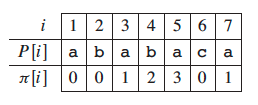

# <center>KMP: String Match</center>
Leetcode Problems: [LC214](https://leetcode.com/problems/shortest-palindrome/)

KMP is an efficient algorithm to find a pattern (e.g., p) match in a given string (e.g., str). The run time is O(m+n), where m and n are the length of the pattern and string, respectively.  
The key is to create a prefix table T of length len(p). T[i] is the max length of prefix that is also a suffix of p[:i+1]. For example, 'ababcd' would lead to a table [0,0,1,2,0,0].  
<p align='center'>
 
</p>
 
<font color='darkred'>Why is that useful?</font> It avoids a lot of invalid search by utilizing the pattern of p. A bruteforce search for string match would be to start from each position of the string and try to find whether it would lead to a match. We summarize the way to generate the table T in below:
```python
T = [0] * len(p)
k = 0
for i in range(1, len(p)):
    k = T[i-1]
    while k > 0 and p[k] != p[i]:
        k = T[k-1]
    if p[k] == p[i]:
        k += 1
    T[i] = k
```
Now, with the table T at hand, we can continue to tackle the task of finding all matched substring in s of a pattern p.
```python
start_idx = []
k = 0 # index on p
for i in range(len(s)): # index on s
    while k > 0 and p[k] != s[i]:
        k = T[k-1]
    if p[k] == s[i]:
        k += 1
    if k == m:
        start_idx.append(i)
        k = p[-1]
```

