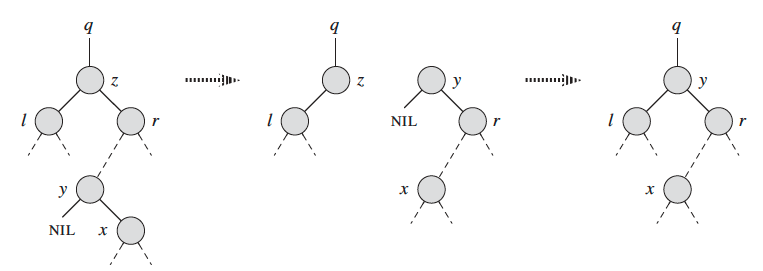

# <center>Binary Search Tree</center>

__What is a BST?__  
It's a special binary tree, with left node < root node < right node.  
```python
# bare-minimal structure
class TreeNode(object):
    def __init__(self, value):
        self.val = value
        self.left = None
        self.right = None
        self.h = 0 # for height balanced tree
        self.p = None
```


We summarize some classic problems of BST.  

__1. Validate BST:__ [LC98](https://leetcode.com/problems/validate-binary-search-tree/) Given a binary tree, determine if it is a valid binary search tree (BST).  
```python
def validateBST(root, lo, hi):
    if not root: return True
    if root.val > hi or root.val < lo:
        return False
    return validate(root.left, lo, root.val) and validate(root.right, root.val, hi)
```

__2. Recover BST__ [LC99](https://leetcode.com/problems/recover-binary-search-tree/) Two elements of a binary search tree (BST) are swapped by mistake. Recover the tree without changing its structure.  

<p align='center'>
    
</p>

## Binary Search Tree with Balanced Height: <font color='orange'>e.g., Ordered Statistic Tree, AVL</font>
```python
class TreeNode(object):
    def __init__(self, value):
        self.val = value
        self.left = None
        self.right = None
        self.h = 0 
        self.p = None
        self.count = 1
        self.left_size = 0
        self.right_size = 0
```
<font color="red">To do</font>: insertion, deletion, balanced BST  
AVL tree is a binary search tree with height balanced. Here, 'balanced' means the absolute difference between the height of any node's left and right child is no more than 1. Now, we discuss several basic operations of BST.  
* __Insertion__:  
```python
def insertion(root, x):
    new_node = TreeNode(x)
    if not root:
        return new_node # empty tree
    p, n = None, root
    while n and n.val != x:
        if x < n.val:
            p, n = n, n.left
        else:
            p, n = n, n.right
    if n:
        return root
    else:
        if x < p.val:
            p.left = new_node
        else:
            p.right = new_node
    return root
```

* __Deletion__:  
```python
def deletion(root, z):
    # (1) find node z
    p, n = None, root
    while n.val != z:
        if z < n.val:
            p, n = n, n.left
        else:
            p, n = n, n.right
    # (2) delete node n
    is_left = True
    if p.right == n:
        is_left = False
    if not n.left:
        if is_left:
            p.left = n.right
        else:
            p.right = n.right
    elif not n.right:
        if is_left:
            p.left = n.left
        else:
            p.right = n.left
    else:
        # (2.1) find the left-most node of n to replace n
        alt = n.right
        p_alt = n
        while alt.left:
            p_alt, alt = alt, alt.left
        if alt == n.right:
            # (2.1.1) replace n directly
            alt.left = n.left
            if is_left:
                p.left = alt
            else:
                p.right = alt
        else:
            # (2.1.2) replace alt by its right child and then replace n by alt
            p_alt.left = alt.right
            alt.right = n.right
            alt.left = n.left
            if is_left:
                p.left = alt
            else:
                p.right = alt
    return root
```
<p align='center'>
      
    <br>
    <em>Figure 1. A tricky case of y not being the right child of the deleted node z. (source: "Introduction to Algorithms 3rd, CLRS.")</em>
</p>

So far, we shall see the run time of both insertion and deletion are O(log(n)). However, this does not conclude the process since it may make the tree imbalanced. We introduce the rotation operation to balance the height. 


* Balance

* Rotation

```python
def left_rotate(node):
    if node.p.right == node:
        node.p.right = node.right
    else:
        node.p.left = node.right
    node.right.p = node.p    
    node.right.left = node
    node.p = node.right
    node.right = None

def right_rotate(node):
    if node.p.right == node:
        node.p.right = node.left
    else:
        node.p.left = node.left
    node.left.p = node.p
    node.left.right = node
    node.p = node.left
    node.left = None
```
* Other instrumental functions
```python

def update_height(node):
    node.height = 1 + update
```


